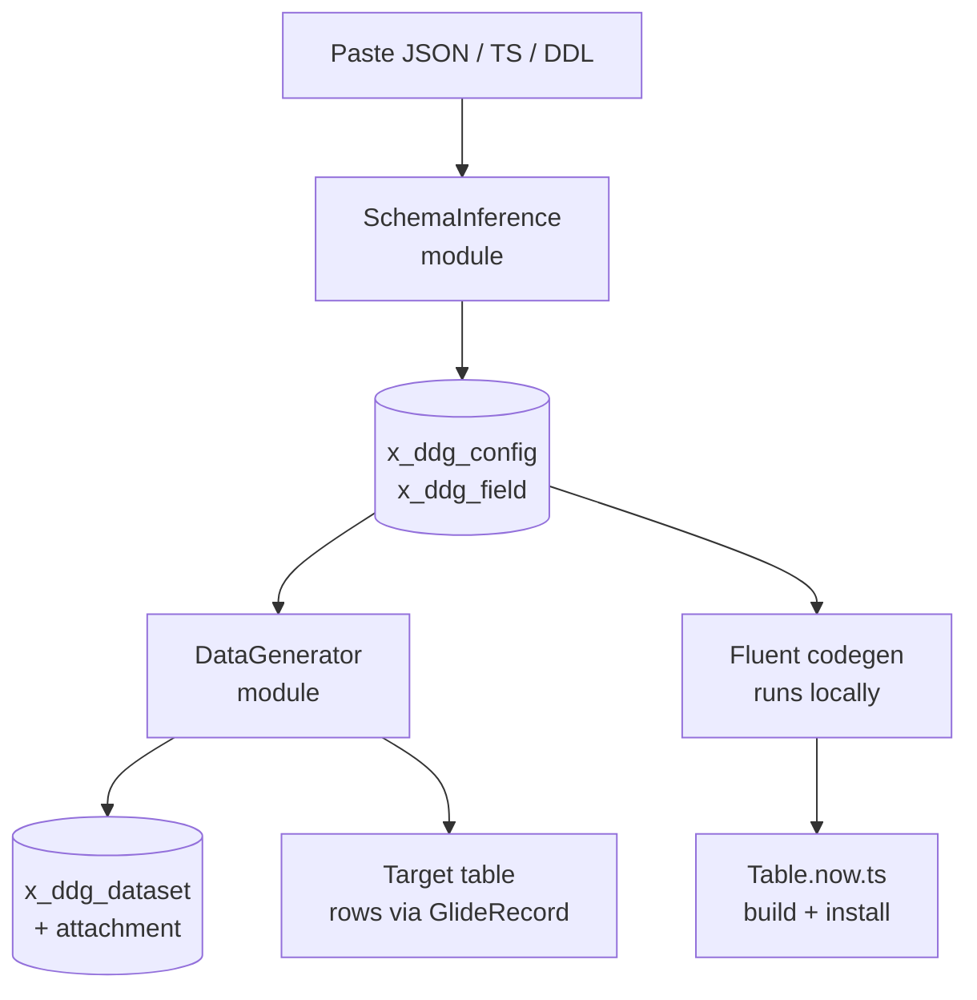

# Porting DDG to ServiceNow

Converting the schema-inference and data-generation core of the Dummy Data Generator into a scoped application deployed with the Now SDK.

Sep 23, 2026 · @Someone

## What ports, what doesn't

The inference layer ports almost unchanged; the generator does not, because `@faker-js/faker` is on ServiceNow's **unsupported** third-party library list. That single fact decides the shape of the whole port: `src/server/generate.ts` is 1,531 lines whose every leaf value comes from a `Faker` instance, and none of it runs on the platform's Rhino-based server runtime.

| Source | Lines | Runtime deps | Verdict |
| --- | --- | --- | --- |
| `src/server/infer.ts` | 633 | none | Ports as-is |
| `src/lib/formula.ts` | 690 | none (hand-written parser) | Ports as-is |
| `src/server/export.ts` | \~150 | none | Ports as-is |
| `src/lib/types.ts` | 865 | none | Ports as-is |
| `src/server/generate.ts` | 1,531 | `@faker-js/faker` | Rewrite the value layer |
| `src/server/script.ts` | 244 | `node:vm`, `fetch` | Replace outright |
| `src/server/db.ts` | 436 | PocketBase SDK | Replace with GlideRecord |
| `src/index.ts` | 953 | `Bun.serve` | Replace with `RestApi()` |

The good news is that the parts carrying the actual design work — type inference from JSON/TypeScript/DDL, the formula and condition evaluators, the distribution math, the flatten/unflatten row model — are pure TypeScript with no imports outside the repo. They compile into a scoped app's `src/server/` module directory with no changes beyond the import paths.

Four runtime facts govern everything else:

- **No `fetch`, no `node:`, no browser globals.** Server-side I/O is Glide only: `GlideRecord`, `sn_ws.RESTMessageV2`, `GlideSysAttachment`.
- **`new Function()` is disallowed**, as is `Reflect`. The hand-written formula parser matters here — it survives precisely because it never reached for `eval`.
- **ES2021 syntax is supported** (optional chaining, `??`, `Map`/`Set`, spread, `async`/`await`, generators). Private class fields and `async` class methods are not.
- **`chance` is on the supported list.** It is the only seeded fake-data library ServiceNow has validated, and it is a fraction of faker's surface.

## Target architecture

The app splits into two halves that the Bun version kept together: a **runtime** half that lives on the instance as records, and a **design-time** half that runs on your laptop and emits Fluent source. Keeping them separate is what makes "schema creation" mean two different, both-useful things on ServiceNow.



| Bun app | Scoped app equivalent |
| --- | --- |
| `Bun.serve` routes | `RestApi()` — one scripted REST service, routes per resource |
| PocketBase `configs` collection | `x_ddg_config` table |
| `schema` JSON blob | `x_ddg_field` child table, one row per field |
| PocketBase `datasets` collection | `x_ddg_dataset` table + attachment for the rows |
| Collection API rules | ACLs plus a `x_ddg.user` role |
| `src/server/generate.ts` | Module in `src/server/`, bridged by a Script Include |
| `src/server/infer.ts` | Module in `src/server/`, unchanged logic |
| `node:vm` enum scripts | Script Include the field names, or a REST Message |
| React SPA | UI Builder workspace, or list/form views |
| CSV / JSON download | `GlideSysAttachment` on the dataset record |

The module-plus-Script-Include pairing is the platform's normal shape and worth getting right early. Business logic lives in `src/server/` as ES modules with typed Glide imports; anything that needs to be callable by name — from a UI Action, GlideAjax, another scope, a scheduled job — gets a thin `Class.create` Script Include that does nothing but `require('./dist/modules/server/…')` and delegate.

## Scaffolding the project

Scaffold into a **new sibling directory**, not into this repo. `now-sdk init` writes into the current working directory without creating a subdirectory, and a Fluent project's `package.json`, `tsconfig.json` and `src/` layout would collide with the Bun app's.

Authenticate first, because the next two steps query the instance:

```bash
npx now-sdk auth --list
echo "$SN_PASSWORD" | npx now-sdk auth --add https://devXXXXX.service-now.com \
  --type basic --alias ddg-dev --username admin --password-stdin
```

`init` does **not** look up your vendor prefix or check that the scope name is free. Run both queries yourself and pick the scope from their results — skipping the second turns a silent collision into a conflicting install later:

```bash
# 1. the vendor prefix this instance assigns
npx now-sdk query sys_properties -q 'name=glide.appcreator.company.code' -o json

# 2. confirm the candidate scope is unclaimed — an empty result means free
npx now-sdk query sys_scope -q 'scope=x_<prefix>_ddg' -o json
```

The scope name is capped at **18 characters** including the `x_` prefix and must match `(x|sn)_[a-z0-9_]+`. With a three-letter vendor prefix, `x_abc_ddg` leaves room; longer prefixes may force `ddg` over something more descriptive. Table names are capped at 30 characters *including* the scope prefix, so budget for that now — `x_abc_ddg_` already spends 10.

```bash
mkdir ../ddg-scoped && cd ../ddg-scoped
npx @servicenow/sdk init \
  --appName "Dummy Data Generator" \
  --packageName "ddg-scoped" \
  --scopeName "x_abc_ddg" \
  --template "base"
npm install
npx now-sdk dependencies
```

`dependencies` fetches type definitions for platform tables and Glide APIs, which is what makes `GlideRecord<'x_abc_ddg_config'>` type-check in your modules. Re-run it whenever you add a table you intend to reference from another scope's schema.

Don't deploy yet. The scaffold is a starting point, not something to push — `npm run deploy` belongs at the end of the first real build/install cycle, once there is something worth installing.

The layout to aim for:

```
src/
  fluent/
    tables/            config.now.ts, field.now.ts, dataset.now.ts
    script-includes/   generator.now.ts, inference.now.ts
    rest/              api.now.ts
    roles/             roles.now.ts
    generated/keys.ts  ← auto-generated, commit it
  server/
    infer/             ported from src/server/infer.ts
    formula/           ported from src/lib/formula.ts
    generate/          the rewritten value layer
    export/            ported from src/server/export.ts
    script-includes/   thin Class.create bridges
now.config.json
```

## The schema layer in Fluent

Split the `schema` JSON blob into a real child table. PocketBase stored the whole `Field[]` array as one 2 MB JSON column because it could; on ServiceNow that choice costs you list views, filtering, per-field ACLs, and the ability to reference a field from anywhere else. One row per field is the platform-shaped version.

```typescript
// src/fluent/tables/config.now.ts
import { Table, StringColumn, IntegerColumn, JsonColumn } from '@servicenow/sdk/core'

export const x_abc_ddg_config = Table({
    name: 'x_abc_ddg_config',
    label: 'Schema Configuration',
    display: 'name',
    allowWebServiceAccess: true,
    schema: {
        name: StringColumn({ label: 'Name', maxLength: 200, mandatory: true }),
        description: StringColumn({ label: 'Description', maxLength: 2000 }),
        row_count: IntegerColumn({ label: 'Row count', default: 100 }),
        seed: StringColumn({ label: 'Seed', maxLength: 200 }),
        locale: StringColumn({ label: 'Locale', maxLength: 20, default: 'en' }),
        metadata: JsonColumn({ label: 'Metadata' }),
    },
})
```

```typescript
// src/fluent/tables/field.now.ts
import { Table, StringColumn, IntegerColumn, BooleanColumn, ReferenceColumn, JsonColumn } from '@servicenow/sdk/core'

export const x_abc_ddg_field = Table({
    name: 'x_abc_ddg_field',
    label: 'Schema Field',
    display: 'field_name',
    allowWebServiceAccess: true,
    schema: {
        config: ReferenceColumn({
            label: 'Configuration',
            referenceTable: 'x_abc_ddg_config',
            cascadeRule: 'delete',
            mandatory: true,
        }),
        field_name: StringColumn({ label: 'Field name', maxLength: 255, mandatory: true }),
        field_type: StringColumn({ label: 'Type', maxLength: 60, mandatory: true }),
        order: IntegerColumn({ label: 'Order' }),
        null_percent: IntegerColumn({ label: 'Null %', min: 0, max: 100 }),
        unique: BooleanColumn({ label: 'Unique' }),
        options: JsonColumn({ label: 'Options' }),
    },
})
```

**`field_type` stays a string, not a `ChoiceColumn`.** The `FieldType` union in `src/lib/types.ts` has roughly 195 members. Expressing that as a `choices` object is 195 lines of Fluent that must be kept in lockstep with the TypeScript union by hand, and every added generator becomes a schema migration. Keep the union as the single source of truth in the module layer and validate on write in a Business Rule; if you want the form to offer a picker, generate the choices from `FIELD_TYPES` in a codegen step rather than maintaining them twice.

`FieldOptions` legitimately stays a `JsonColumn`. It is a genuinely heterogeneous bag — `min`/`max` for numerics, `values`/`weights` for enums, `pattern` for templates, `refDataset`/`refField` for references — and flattening 40-odd optional properties into columns would produce a table that is mostly null.

Three naming rules the build enforces, and will fail on:

- The exported **variable name must equal the `name` property exactly**. `export const x_abc_ddg_config = Table({ name: 'x_abc_ddg_config', … })`, never a shorter alias.
- Table names must start with the scope prefix and end with a letter or digit. Columns on a table *you* define need no prefix at all — `name` and `seed` are fine, and prefixing them is noise.
- Never name a column with a `sys_` prefix. `sysId` and `sysClassName` are DDG *generator types*, not column names; the column holding a generated sys\_id should be called something like `generated_sys_id`.

`FieldMapping` — cross-configuration references — becomes its own small table with two `ReferenceColumn`s (`config`, `from_config`) and two string columns for the field names, mirroring how the type already models it as a property of the configuration rather than of the field.

Set `allowWebServiceAccess: true` on any table you intend to read through `/api/now/table`. Without it, REST calls return 403 even when the ACLs are correct — a failure mode that looks exactly like a permissions bug and is not one.

## Codegen: inferred schema → Fluent tables

This is the half that makes the port worth doing. DDG already turns a pasted JSON sample, TypeScript interface or `CREATE TABLE` statement into a typed field list. On ServiceNow that field list has an obvious second destination: a `Table()` definition you commit and install. Paste a DDL statement, get a real scoped table.

Run this **locally, not on the instance**. It emits `.now.ts` source, which the build then compiles — nothing about it belongs in a Script Include. A `prebuild` entry in `now.config.json`'s `scripts` block is the natural hook, or just a standalone `npm run codegen`.

The mapping from `FieldType` to column type collapses \~195 generators onto about a dozen columns:

| `FieldType` group | Column | Notes |
| --- | --- | --- |
| `integer`, `age`, `quantity`, `seatCount`, `port` | `IntegerColumn` | carry `min`/`max` from `FieldOptions` |
| `float`, `price`, `latitude`, `transactionAmount` | `DecimalColumn` | `FloatColumn` when `decimals` is set |
| `boolean` | `BooleanColumn` |  |
| `date`, `pastDate`, `futureDate`, `recentDate` | `DateColumn` / `DateTimeColumn` | switch on `options.format` |
| `email` | `EmailColumn` |  |
| `url`, `avatarUrl`, `imageUrl` | `UrlColumn` |  |
| `enum` with `values` | `ChoiceColumn` | `values[]` becomes the `choices` object |
| `object`, `bundle`, `array` | `JsonColumn` | or flatten to dot-path columns |
| `paragraph`, `markdown`, `bio`, `stackTrace` | `MultiLineTextColumn` |  |
| everything else | `StringColumn` | `maxLength` from observed samples |

Two transformations the emitter must do, both of which the Bun app gets for free and the platform does not:

**Column names need normalising.** DDG field names are free-form and nest as dot paths (`address.city`). ServiceNow column names are lowercase letters, digits and underscores only. Snake-case the name, replace dots with underscores, and truncate — then check for collisions, because `address.city` and `address_city` normalise to the same thing.

**Name lengths are capped.** The table name including the scope prefix must fit in 30 characters. With `x_abc_ddg_` consuming 10, an inferred table called `customer_subscription_events` will not fit and the build will reject it. Truncate deterministically and report what you did rather than failing silently.

A sketch of the emitter:

```typescript
// tools/codegen.ts — runs on Node/Bun locally, never on the instance
import { inferSchema } from '../src/server/infer'

const COLUMN_FOR: Partial<Record<FieldType, string>> = {
    integer: 'IntegerColumn', float: 'DecimalColumn', boolean: 'BooleanColumn',
    email: 'EmailColumn', url: 'UrlColumn', date: 'DateColumn',
    // … the rest of the table above
}

function emitTable(scope: string, tableName: string, fields: Field[]): string {
    const used = new Set<string>()
    const lines = fields.map(f => {
        const col = COLUMN_FOR[f.type] ?? 'StringColumn'
        used.add(col)
        return `        ${columnName(f.name)}: ${col}({ label: ${JSON.stringify(f.name)} }),`
    })
    return [
        `import { Table, ${[...used].sort().join(', ')} } from '@servicenow/sdk/core'`,
        ``,
        `export const ${scope}_${tableName} = Table({`,
        `    name: '${scope}_${tableName}',`,
        `    schema: {`,
        ...lines,
        `    },`,
        `})`,
    ].join('\n')
}
```

Emit only the column types actually used. Unused imports from `@servicenow/sdk/core` are a build error, not a lint warning.

One hazard worth stating plainly: **regenerating a `.now.ts` file that dropped a column is a tracked deletion.** Every record Fluent defines has its identity in `keys.ts`, and a `keys.ts` entry with no matching Fluent code is read as an intentional delete — it ships a delete record that removes the column from every instance the app is installed on, including through future upgrades. A codegen step that overwrites table definitions wholesale can therefore drop production columns without anyone reviewing a diff. Write the emitted file to a scratch path and diff it before overwriting, and never let codegen run unattended in CI against a file that has already been installed.

## Replacing faker

This is the bulk of the work and the only part with no clean answer. `@faker-js/faker` is explicitly listed as **unsupported** on the ServiceNow server runtime — not "untested", tested and does not work. `chance` is on the supported list and is the closest substitute, but it covers a fraction of what DDG uses.

The actual surface `generate.ts` depends on is narrower than 1,500 lines suggests. Counted across the file:

| Faker call | Uses | Replacement |
| --- | --- | --- |
| `helpers.arrayElement` | 27 | 3 lines over a seeded PRNG |
| `number.int` | 24 | 3 lines |
| `string.numeric` / `alphanumeric` / `alpha` / `hexadecimal` | 40 | \~15 lines total |
| `number.float` | 5 | 3 lines |
| `helpers.weightedArrayElement` | 2 | \~10 lines |
| `lorem.*`, `person.*`, `location.*`, `company.*` | \~60 | `chance`, or bundled word lists |
| `airline.*`, `book.*`, `food.*`, `music.*`, `animal.*`, `vehicle.*`, `science.*` | \~30 | bundled word lists |

Roughly two thirds of the calls are pure arithmetic and string assembly over a random stream. Those need no library at all — they need one seeded PRNG and a handful of helpers. The remaining third is the part that needs *data*: names, cities, company names, book titles, airline names.

### The recommended shape

Write a small `Random` class with the exact faker-shaped surface the generator already calls, back it with a seeded PRNG, and change `generate.ts` in one place — the `fakerFor()` factory — rather than at 232 call sites.

```typescript
// src/server/generate/random.ts
import { DATA } from './data'   // word lists, bundled as JSON

/** mulberry32 — deterministic, 4 lines, no dependency. */
function mulberry32(seed: number): () => number {
    return function () {
        seed = (seed + 0x6d2b79f5) | 0
        let t = Math.imul(seed ^ (seed >>> 15), 1 | seed)
        t = (t + Math.imul(t ^ (t >>> 7), 61 | t)) ^ t
        return ((t ^ (t >>> 14)) >>> 0) / 4294967296
    }
}

export class Random {
    private next: () => number

    constructor(seed?: number) {
        this.next = mulberry32(seed ?? Math.floor(Math.random() * 2 ** 32))
    }

    // mirrors f.number.int({ min, max })
    readonly number = {
        int: (o: { min: number; max: number }) =>
            Math.floor(this.next() * (o.max - o.min + 1)) + o.min,
        float: (o: { min: number; max: number }) =>
            this.next() * (o.max - o.min) + o.min,
    }

    readonly helpers = {
        arrayElement: <T>(items: readonly T[]): T =>
            items[Math.floor(this.next() * items.length)],
    }

    readonly person = {
        firstName: () => this.helpers.arrayElement(DATA.firstNames),
        lastName: () => this.helpers.arrayElement(DATA.lastNames),
        fullName: () => `${this.person.firstName()} ${this.person.lastName()}`,
    }
}
```

Keeping the property-bag shape (`r.number.int`, `r.person.firstName`) means `generate.ts` ports by changing its import and its type annotation, and nothing else. The existing `hashSeed()` already maps a text seed to a 32-bit integer, so reproducible runs keep working exactly as they do today.

### The word lists

Bundle them as JSON under `src/server/generate/data/`, imported as modules. A few hundred first names, last names, cities, states, companies and street names covers the overwhelming majority of real use, and you control the size. Faker ships megabytes across every locale; you almost certainly want one locale and a few kilobytes.

This is where the `locale` field on `SchemaConfig` gets scoped down. Supporting `allFakers`' full locale set is not realistic here — pick the locales you will actually ship, bundle a word list per locale, and have `fakerFor()`'s replacement fall back to the default the same way it does now.

### Why not just use `chance`

You can, and for `person`, `address` and a few primitives it saves work. But it does not cover the domain-specific generators that are most of DDG's value — ICD-10 codes, IMEIs with valid check digits, CVE ids, k8s pod names, ISINs, trace ids. Those are already hand-written in `generate.ts` on top of faker *primitives*, so they port directly to the `Random` class above. Adding `chance` as well means two random streams and two seeding mechanisms, which breaks reproducibility. Pick one, and `Random` is the one that needs no dependency at all.

### What ports untouched

The distribution math (`standardNormal`, log-normal, Pareto), the check-digit algorithms (Luhn, UPC-A, EAN-13, ISIN, CUSIP, NPI), the weighted-choice logic, the uniqueness trackers, the template-pattern expander, and the `resolveOrder` dependency sort are all pure functions over a random stream. They move across as-is once `Random` is in place — that is most of the file's genuine complexity, and none of it is at risk.

## Enum choice scripts without `node:vm`

Drop the user-authored-snippet model. `src/server/script.ts` runs an async function body inside a `node:vm` context with `fetch` in scope; on the platform both halves are gone — there is no `vm`, no `fetch`, and `new Function()` is disallowed outright. There is no port of this feature, only a replacement.

The file's own comment is candid that the sandbox "is a guard against mistakes, not against malice" and that sign-up being open makes that a real concern. On ServiceNow that concern gets worse, not better: a snippet would run with the app's own privileges against a system of record. Replacing the feature is the right outcome regardless of what the runtime allows.

Three replacements, in order of preference:

**1. A Script Include the field names.** Store a script include *name* in `FieldOptions` instead of a script *body*. Generation looks the name up and calls a known method. Whoever writes the script include needs the role to create one, which is exactly the authorisation boundary the `node:vm` sandbox was trying and failing to draw.

```typescript
// options: { valuesFrom: 'script', scriptInclude: 'DdgIncidentStates' }
const ChoiceSource = Class.create()
ChoiceSource.prototype = {
    initialize: function () {},
    getChoices: function () {
        const out = []
        const gr = new GlideRecord('sys_choice')
        gr.addQuery('name', 'incident')
        gr.addQuery('element', 'state')
        gr.query()
        while (gr.next()) out.push(gr.getValue('value'))
        return out
    },
    type: 'ChoiceSource',
}
```

**2. An encoded query against a table.** DDG already has the `nowQuery` field type carrying `table` and `query`, so the shape exists. For "draw values from a live column", a `GlideRecord` with an encoded query covers most of what the snippets were reaching out over HTTP to do — and on-instance it is a local read rather than a network round trip.

**3. `sn_ws.RESTMessageV2` for genuinely external sources.** If the choices really do come from a third-party API, that is a REST Message record plus an outbound connection, which is the platform's supported path and gets you credential storage, logging and MID server routing for free.

```typescript
import { sn_ws } from '@servicenow/glide/sn_ws'

export function fetchChoices(endpoint: string): string[] {
    const request = new sn_ws.RESTMessageV2()
    request.setEndpoint(endpoint)
    request.setHttpMethod('GET')
    const response = request.execute()
    if (response.getStatusCode() !== 200) return []
    return JSON.parse(response.getBody())
}
```

Verify the exact import path and method names against the type definitions `now-sdk dependencies` generates — only use methods that appear in `@servicenow/glide`, rather than assuming a method exists from its name.

One knock-on: `resolveChoiceScripts()` exists to keep `generateRows()` synchronous by resolving every dynamic source up front. Keep that structure exactly. It is still the right design — resolve all choice sources before the row loop, deduplicate identical sources so one source is read once, and let the generator stay synchronous. The concurrency trick (starting every request before awaiting any) is worth less on-instance, since these become local queries, but the shape costs nothing to preserve.

## Running a generation at scale

The Bun app caps a run at 100,000 rows and stores them whole as a 64 MB JSON column. Neither number survives the move. A synchronous 100k-row generation inside a single interactive transaction will hit the platform's transaction quota, and a 64 MB value in a `JsonColumn` is a performance problem on every read of that record.

Three changes, none optional:

**Rows go to an attachment, not a column.** The `x_abc_ddg_dataset` record keeps metadata — name, config reference, row count, field count, created — and the rows themselves become a CSV or JSON attachment written with `GlideSysAttachment`. `export.ts` already produces exactly those two serialisations, so this is a plumbing change, not a rewrite. It also solves the download problem: an attachment is already a file the platform will serve.

**Large runs go asynchronous.** Anything past a few thousand rows belongs in a `ScheduledScript`, or a job the REST endpoint enqueues and returns a dataset id for immediately. The endpoint answers with `202` and a record to poll; the job writes progress to a `state` column on the dataset record. Small runs — a preview of 10 rows in a form — can stay synchronous.

**Inserts are batched and the row loop never holds everything in memory.** `generateRows()` currently builds the full array and returns it. For a target-table run, restructure it to yield or accept a callback per row so the generator streams into `GlideRecord` inserts rather than materialising 100k objects first.

```typescript
import { GlideRecord, gs } from '@servicenow/glide'

export function insertRows(table: string, rows: Row[]): number {
    let inserted = 0
    for (const row of rows) {
        const gr = new GlideRecord(table)
        gr.initialize()
        for (const [column, value] of Object.entries(row)) {
            if (value === null || value === undefined) continue
            gr.setValue(column, String(value))
        }
        if (gr.insert()) inserted++
    }
    gs.info(`[ddg] inserted ${inserted} of ${rows.length} into ${table}`)
    return inserted
}
```

Row-at-a-time `GlideRecord.insert()` is the honest baseline and it is not fast. If throughput matters, the levers are: turning off business rules and workflow on the insert where the target table allows it, generating into a staging table and using an Import Set transform map for the final load, or simply accepting a slower job because it runs asynchronously anyway.

Be deliberate about **where generated rows land**. DDG's Bun version only ever writes to its own dataset store. On ServiceNow the far more useful mode is generating straight into a real table — populating `incident`, or a scoped app's own tables, with realistically-shaped test data. That means the generator needs a target-table mode with column mapping, and it means writes leave your scope. Treat that as a distinct, role-gated operation rather than a flag on the existing endpoint; `sysId`, `sysClassName`, `nowRecordNumber` and `journalEntry` already exist as field types precisely because this is the mode people will want.

Also reconsider the 100k cap itself. Pick a number from what the instance tolerates, expose it as a **system property** (`x_abc_ddg.max_rows`) read with `gs.getProperty()`, and let admins tune it without a code change.

## Exposing it: REST, roles, UI

### The REST API

`src/index.ts` has 36 routes. Do not port them all — most exist to serve the React SPA and have no audience on a platform where lists and forms come free. The subset worth a `RestApi()` definition is the one a CI pipeline or a developer's script would call:

| Route | Method | Purpose |
| --- | --- | --- |
| `/infer` | POST | paste a structure, get a field list |
| `/config/{id}/generate` | POST | run a generation, return a dataset id |
| `/dataset/{id}` | GET | dataset metadata and status |
| `/dataset/{id}/export` | GET | rows as CSV or JSON |

```typescript
// src/fluent/rest/api.now.ts
import { RestApi } from '@servicenow/sdk/core'
import { inferHandler } from '../../server/rest/infer'
import { generateHandler } from '../../server/rest/generate'

RestApi({
    $id: Now.ID['ddg-api'],
    name: 'Dummy Data Generator',
    serviceId: 'ddg',
    consumes: 'application/json',
    produces: 'application/json',
    routes: [
        {
            $id: Now.ID['ddg-api-infer'],
            name: 'infer',
            method: 'POST',
            path: '/infer',
            script: inferHandler,
        },
        {
            $id: Now.ID['ddg-api-generate'],
            name: 'generate',
            method: 'POST',
            path: '/config/{configId}/generate',
            script: generateHandler,
        },
    ],
})
```

Route handlers are one of the APIs that **accept function imports**, so the handler is a typed module in `src/server/` rather than a string — use that. The endpoint lands at `/api/x_abc_ddg/ddg/infer`; `namespace` defaults to the application scope.

### Access control

This is the part of the current design that translates most cleanly, because the app already got it right. The Bun server holds no credentials and grants nothing on its own — every request carries the caller's own token and PocketBase's collection rules decide what they see. ServiceNow works the same way: the session is the caller's, and ACLs on the table decide.

So keep the principle and change the mechanism. Define a role and let ACLs enforce it; do not reintroduce privilege inside the generator module.

```typescript
import { Role, Acl } from '@servicenow/sdk/core'

export const ddgUser = Role({
    $id: Now.ID['ddg-user-role'],
    name: 'x_abc_ddg.user',
    description: 'Create and run schema configurations',
})

Acl({
    $id: Now.ID['ddg-config-read'],
    type: 'record',
    operation: 'read',
    table: 'x_abc_ddg_config',
    roles: [ddgUser],
})
```

Two differences from the PocketBase model to plan for:

- **Per-record ownership** is not automatic. PocketBase rules compared the record's owner to the caller; on ServiceNow, `sys_created_by` gives you the equivalent, enforced through an ACL condition or a `before query` Business Rule.
- **Sharing** — the `sharedWith` array and the `/api/ddg/shares/...` hook routes — has no direct analogue. The platform answer is either a group-based ACL or simply making configurations readable app-wide and writable by their creator. The custom sharing model is a candidate for the cut list.

### UI

The React SPA does not port. Three options, cheapest first:

1. **Lists and forms only.** Define an `ApplicationMenu` with modules for Configurations, Fields and Datasets, plus a UI Action for "Generate". This is free, and for an internal dev tool it may be the whole answer.
2. **UI Builder workspace.** The current supported path for a real application UI, and the one to pick if the schema editor needs to feel like an editor.
3. **A Service Portal widget or UI Page.** Available, and both take `Now.include()` for HTML, client script and CSS — but neither is where the platform is heading.

Start at option 1. The schema editor's field-by-field tuning maps surprisingly well onto a standard related list on the config form, and you find out what genuinely needs custom UI before building any.

## Build, deploy, and record identity

The inner loop is two commands, in this order, every time:

```bash
npm run build     # compiles and validates Fluent, writes artifacts
npm run deploy    # installs the last build to the authenticated instance
```

A failed build leaves the previous artifacts in place, so deploying without a clean build pushes stale output. Prefer the npm scripts over calling `now-sdk build` / `now-sdk install` directly — a real app accumulates extra build steps (the codegen step above, for one) wired into those scripts.

### keys.ts is the identity contract

`src/fluent/generated/keys.ts` maps every `Now.ID['…']` key to a generated sys\_id. It is auto-generated, and it belongs in version control — it is the source of truth for which local definition corresponds to which record on every instance the app is installed on.

Four rules that matter more here than in a typical app, because this one generates source code:

- **Never write a sys\_id by hand.** Always `Now.ID['descriptive-key']`. A fabricated sys\_id collides across projects and bypasses key tracking entirely. The only raw sys\_ids that are safe are ones a `query` or `transform` returned from a real instance.
- **Renaming a key creates a new record** and orphans the old one. Key names are effectively permanent once installed.
- **Deleting a Fluent definition is a tracked deletion.** Removing a `Table()`, `BusinessRule()` or `Record()` call while its `keys.ts` entry remains generates a delete record that ships with the app and removes that record from every instance on upgrade. That is the correct behaviour for a genuine removal and a serious hazard for a codegen pipeline. Never delete a definition as a quick way to tidy up.
- **Use `--frozenKeys` in CI**, so a build fails rather than silently regenerating a `keys.ts` that is out of date relative to the committed one.

### Two-way sync

`transform` with no `--from` reads your authenticated instance and rewrites the matching `.now.ts` files — useful when someone edits a record in Studio instead of in source. It overwrites local changes to any record it touches, so commit first. Scope it with `--table` and `--id` rather than pulling the whole app.

For anything the codegen step owns, add `// @fluent-disable-sync-for-file` at the top of the generated file. Otherwise a `transform` and a `codegen` run will fight over the same file, each convinced it is authoritative.

### Packaging

`now-sdk pack` produces a ZIP with the update set XML and a `package_inventory.csv` SHA-256 manifest, which is what you hand over if the app ships to instances you do not control.

## Phased plan and cut list

Sequence the work so the riskiest unknown — whether the ported generator produces correct values under Rhino — is answered in phase 2, not phase 5.

| Phase | Deliverable | Proves |
| --- | --- | --- |
| 1 | Scope, tables, role, ACLs; one hand-written config record | The schema model and access control work |
| 2 | `Random` class + 20 field types, bridged by a Script Include | The generator runs on Rhino and reproduces seeds |
| 3 | `infer.ts` and `formula.ts` ported; REST `/infer` endpoint | The pure-TS layer compiles and runs unchanged |
| 4 | Full field-type coverage; dataset table + attachment export | Feature parity on the generation path |
| 5 | Codegen: inferred schema → `.now.ts` tables | The design-time half, the reason to do this at all |
| 6 | Target-table generation; async jobs; UI | Scale and the on-platform use case |

Phase 2 is the go/no-go. Port `hashSeed`, the `Random` class, `drawNumber` with all four distributions, and a dozen representative field types — then assert that a given seed produces byte-identical output to the Bun version. If seeded reproducibility does not hold across the two runtimes, every downstream assumption about fixtures changes, and you want to know that in week one.

### Cut list

These should not come along. Each is either unbuildable on the platform or solves a problem the platform already solves:

- **`node:vm` enum snippets** — no runtime support, and a worse security posture on a system of record. Replaced by named Script Includes (see above).
- **The custom sharing model** — `sharedWith`, the `/api/ddg/shares/...` hook routes, `src/server/share.ts`. ACLs and groups cover this.
- **Auth, sessions, API keys** — `session.ts`, `auth.ts`, `apiKeys.ts`. The platform owns identity; a scoped app that reimplements it is doing something wrong.
- **Telegram notifications** — `telegram.ts`, 428 lines server-side plus tests. If notifications matter, that is a Notification record or a Flow, not an outbound bot integration.
- **The React SPA and its \~40 components** — replaced by lists, forms, and eventually UI Builder.
- **The CLI** (`src/cli/`, 723 lines of commands) — `now-sdk` and the REST API cover it.
- **OpenAPI document generation** — `openapi.ts` is 1,722 lines. Scripted REST APIs are self-documenting on the platform.
- **Notes** — `notes.ts` server and lib. Unrelated to schema creation or data generation.

That removes roughly 6,000 lines of the \~19,800 in `src/` before any porting starts, and it is worth doing the subtraction first: the honest scope of this conversion is `infer.ts`, `formula.ts`, `types.ts`, `export.ts` and the value layer of `generate.ts` — about 3,900 lines, of which only `generate.ts` needs real rewriting.

### Open questions

- Which instance is the target, and is there a vendor prefix already assigned? Both queries in the scaffolding section need answering before a scope name is picked.
- Is the primary use generating rows into **DDG's own dataset store**, or into **real ServiceNow tables**? The second is more valuable and changes the priority of phase 6.
- How many locales must ship? This sets the size of the bundled word lists and is hard to widen later.
